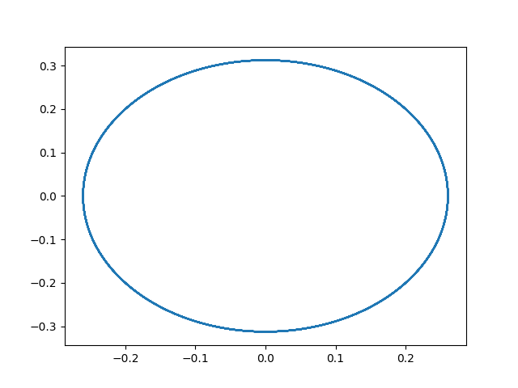
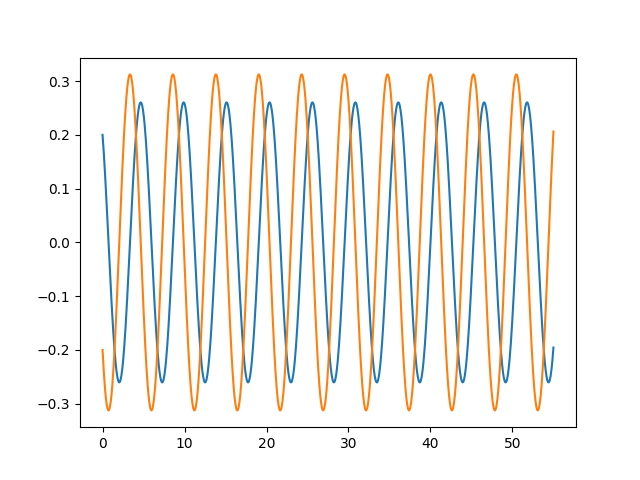
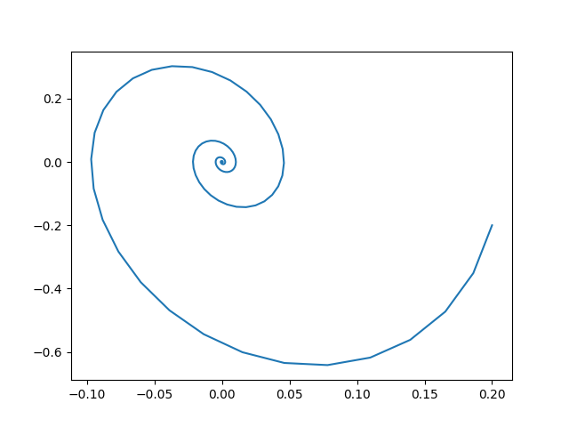
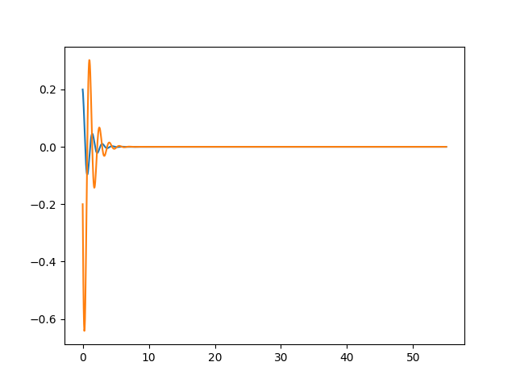
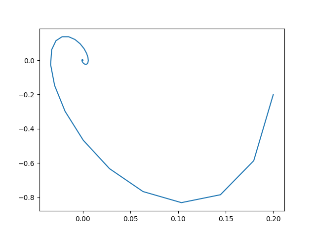
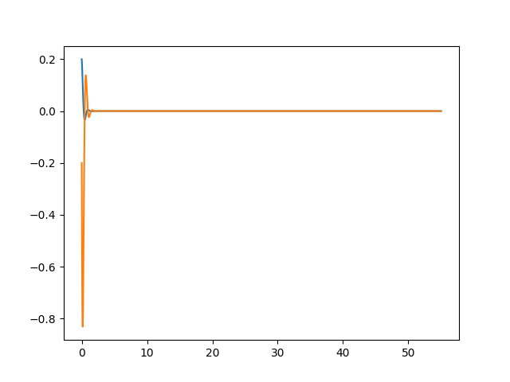

---
## Front matter
lang: ru-RU
title: "Лабораторная работа №4: Модель гармонических колебаний"
subtitle: "*дисциплина: Математическое моделирование*"
author: "Ширяев Кирилл Владимирович"


## Formatting
mainfont: PT Serif
romanfont: PT Serif
sansfont: PT Sans
monofont: PT Mono
toc: false
slide_level: 2
theme: metropolis
header-includes:
 - \metroset{progressbar=frametitle,sectionpage=progressbar,numbering=fraction}
 - '\makeatletter'
 - '\beamer@ignorenonframefalse'
 - '\makeatother'
aspectratio: 43
section-titles: true

---

# Цель работы

Ознакомиться с моделью гармонических колебаний и построить фазовые портреты гармонического осциллятора по этой модели.

# Задание

Построить фазовый портрет гармонического осциллятора и решение уравнения гармонического осциллятора на интервале $t\in[0;55]$
(шаг $0.05$) с начальными условиями $x_0=0.2, y_0=-0.2$ для следующих случаев:
1. Колебания гармонического осциллятора без затуханий и без действий внешней силы $\ddot{x}+1.2x=0$

2. Колебания гармонического осциллятора c затуханием и без действий внешней силы $\ddot{x}+2\dot{x}+4.3x=0$

3. Колебания гармонического осциллятора c затуханием и под действием внешней силы $\ddot{x}+7.4\dot{x}+7.5x=2.2cos(0.6t)$


# Выполнение лабораторной работы

# Библиотеки

Подключаю все необходимые библиотеки
```
import numpy as np
import matplotlib.pyplot as plt
from scipy.integrate import odeint
```

# Значения
Ввод значений из своего варианта (39 вариант) 
```
x0 = 0.2
y0 = -0.2

t0 = 0.0;
tmax = 55;
dt = 0.05


t = np.arange(t0,tmax+dt,dt)

v0 = [x0,y0]
```


# Задание №1
Ввод параметров осциллятора для задания №1 

```
w = 1.2
g = 0
```

Система для задания №1

```
def y(v,t):
    x,y = v
    return [y,-1*np.power(w,2)*x - g * y]

ans_1 = odeint(y,v0,t);
```

# Вывод задания №1
Вывод фазового портрета гармонических колебаний для задания №1(рис. -@fig:001).
{ #fig:001 width=70% }

# Вывод задания №1
Вывод решения уравнения гармонического осциллятора для задания №1(рис. -@fig:002).
{ #fig:002 width=70% }

# Задание №2
Ввод параметров осциллятора для задания №2
```
w = 4.3
g = 2
```

# Вывод задания №2
Вывод фазового портрета гармонических колебаний для задания №2(рис. -@fig:003).
{ #fig:003 width=70% }

# Вывод задания №2
Вывод решения уравнения гармонического осциллятора для задания №2(рис. -@fig:004).
{ #fig:004 width=70% }

# Задание №3
Ввод параметров осциллятора для задания №3
```
w = 7.5
g = 7.4
```

Функция f для задания №3
```
def f(t):
    return 2.2 * cos(0.6*t)
```

Система для задания №3
```
def y_2(v,t):
    x,y = v
    return [y,-1*np.power(w,2)*x - g * y - f(t)]
```

# Вывод задания №3
Вывод фазового портрета гармонических колебаний для задания №3(рис. -@fig:005).
{ #fig:005 width=70% }

# Вывод задания №3
Вывод решения уравнения гармонического осциллятора для задания №3(рис. -@fig:006).
{ #fig:006 width=70% }

# Выводы

Я ознакомился с моделью гармонических колебаний и построила фазовые портреты гармонических колебаний
