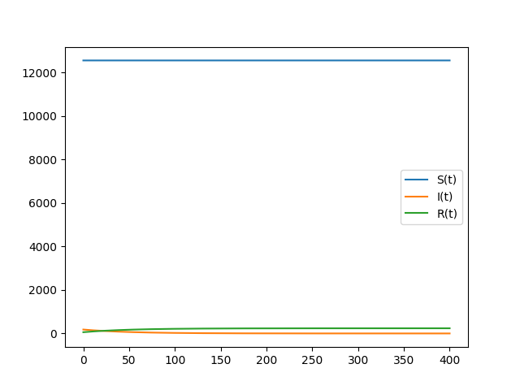
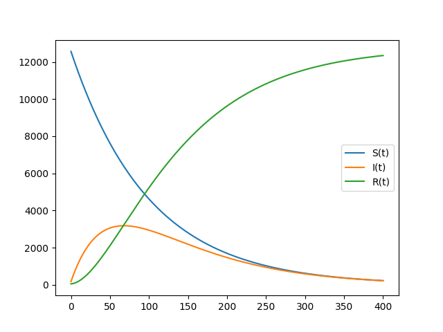

---
## Front matter
lang: ru-RU
title: "Лабораторная работа №6: Модель эпидемия"
subtitle: "*дисциплина: Математическое моделирование*"
author: "Ширяев Кирилл Владимирович"
date: 2021, 11 March

## Formatting
mainfont: PT Serif
romanfont: PT Serif
sansfont: PT Sans
monofont: PT Mono
toc: false
slide_level: 2
theme: metropolis
header-includes:
 - \metroset{progressbar=frametitle,sectionpage=progressbar,numbering=fraction}
 - '\makeatletter'
 - '\beamer@ignorenonframefalse'
 - '\makeatother'
aspectratio: 43
section-titles: true

---

# Цель работы

Ознакомиться с моделью "эпидемия" и построить графики по этой модели.

# Задание

Вариант 39

Для модели «эпидемия»:

$$\frac{{d}S}{{d}t} = 
\begin{cases}
-0.01S,I(t) > I^*\\
0,I(t) \leq I^*
\end{cases}$$

$$\frac{{d}I}{{d}t} = 
\begin{cases}
0.01S - 0.02I,I(t) > I^*\\
-0.02 I,I(t) \leq I^*
\end{cases}$$

$$\frac{{d}R}{{d}t} = 0.02I
$$

Построить графики изменения числа особей в каждой из трех групп в случае:  
1)$I(0) \leq I^*$  
2)$I(0) > I^*$  
При следующих начальных условиях: $N = 12800,I(0) = 180,R(0)=58$.


# Выполнение лабораторной работы

# Библиотеки

Подключаю все необходимые библиотеки

```
import numpy as np
import matplotlib.pyplot as plt
from scipy.integrate import odeint
```

# Значения

Ввод значений из своего варианта (39 вариант)
```
a = 0.01
b = 0.02

N = 12800
I = 180
R = 58
S = N - I - R

t = np.arange(0,400,0.01)

v = [S,I,R]
```

# Решение системы для случая $I(0) \leq I^*$
```
def f1(v,t):
    dS = 0
    dI = -1*b*v[1]
    dR = b*v[1]
    return [dS,dI,dR]

res = odeint(f1,v,t)
```

# Решение системы для случая $I(0) > I^*$
```
def f2(v,t):
    dS = -1*a*v[0]
    dI = a*v[0] - b*v[1]
    dR = b*v[1]
    return [dS,dI,dR]

res = odeint(f2,v,t)
```


# Вывод графика №1

Вывод графика изменения числа особей в каждой из трех групп для случая $I(0) \leq I^*$ (рис. -@fig:001).

{#fig:001 width=70% }

# Вывод графика №2

Вывод графика изменения числа особей в каждой из трех групп для случая $I(0) > I^*$ (рис. -@fig:002).

{#fig:002 width=70% }

# Выводы

Я ознакомился с моделью "эпидемия" и построил графики по этой модели.