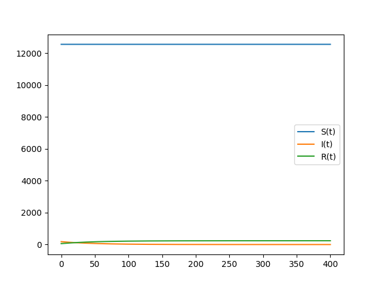

---
# Front matter
lang: ru-RU
title: "Отчет по лабораторной работе №6"
subtitle: "Эпидемия"
author: "Ширяев Кирилл Владимирович"
group: "НФИбд-03-18"
ID: "1032182518"


# Formatting
toc-title: "Содержание"
toc: true # Table of contents
toc_depth: 2
lof: true # List of figures
fontsize: 12pt
linestretch: 1.5
papersize: a4paper
documentclass: scrreprt
polyglossia-lang: russian
polyglossia-otherlangs: english
mainfont: PT Serif
romanfont: PT Serif
sansfont: PT Sans
monofont: PT Mono
mainfontoptions: Ligatures=TeX
romanfontoptions: Ligatures=TeX
sansfontoptions: Ligatures=TeX,Scale=MatchLowercase
monofontoptions: Scale=MatchLowercase
indent: true
pdf-engine: lualatex
header-includes:
  - \linepenalty=10 # the penalty added to the badness of each line within a paragraph (no associated penalty node) Increasing the value makes tex try to have fewer lines in the paragraph.
  - \interlinepenalty=0 # value of the penalty (node) added after each line of a paragraph.
  - \hyphenpenalty=50 # the penalty for line breaking at an automatically inserted hyphen
  - \exhyphenpenalty=50 # the penalty for line breaking at an explicit hyphen
  - \binoppenalty=700 # the penalty for breaking a line at a binary operator
  - \relpenalty=500 # the penalty for breaking a line at a relation
  - \clubpenalty=150 # extra penalty for breaking after first line of a paragraph
  - \widowpenalty=150 # extra penalty for breaking before last line of a paragraph
  - \displaywidowpenalty=50 # extra penalty for breaking before last line before a display math
  - \brokenpenalty=100 # extra penalty for page breaking after a hyphenated line
  - \predisplaypenalty=10000 # penalty for breaking before a display
  - \postdisplaypenalty=0 # penalty for breaking after a display
  - \floatingpenalty = 20000 # penalty for splitting an insertion (can only be split footnote in standard LaTeX)
  - \raggedbottom # or \flushbottom
  - \usepackage{float} # keep figures where there are in the text
  - \floatplacement{figure}{H} # keep figures where there are in the text
---

# Цель работы

Ознакомиться с моделью "эпидемия" и построить графики по этой модели.

# Задание

Вариант 39

Для модели «эпидемия»:

$$\frac{{d}S}{{d}t} = 
\begin{cases}
-0.01S,I(t) > I^*\\
0,I(t) \leq I^*
\end{cases}$$

$$\frac{{d}I}{{d}t} = 
\begin{cases}
0.01S - 0.02I,I(t) > I^*\\
-0.02 I,I(t) \leq I^*
\end{cases}$$

$$\frac{{d}R}{{d}t} = 0.02I
$$

Построить графики изменения числа особей в каждой из трех групп в случае:  
1)$I(0) \leq I^*$  
2)$I(0) > I^*$  
При следующих начальных условиях: $N = 12800,I(0) = 180,R(0)=58$.

# Теоретическая справка
Рассмотрим простейшую модель эпидемии. Предположим, что некая
популяция, состоящая из $N$ особей, (считаем, что популяция изолирована)
подразделяется на три группы. Первая группа - это восприимчивые к болезни, но
пока здоровые особи, обозначим их через $S(t)$. Вторая группа – это число
инфицированных особей, которые также при этом являются распространителями
инфекции, обозначим их $I(t)$. А третья группа, обозначающаяся через $R(t)$ – это
здоровые особи с иммунитетом к болезни.  
До того, как число заболевших не превышает критического значения
$I^*$, считаем, что все больные изолированы и не заражают здоровых. Когда $I(t)>I^*$ ,
тогда инфицирование способны заражать восприимчивых к болезни особей.  

Таким образом, скорость изменения числа $S(t)$ меняется по следующему
закону:

$$\frac{{d}S}{{d}t} = 
\begin{cases}
-\alpha S,I(t) > I^*\\
0,I(t) \leq I^*
\end{cases}$$

Поскольку каждая восприимчивая к болезни особь, которая, в конце концов,
заболевает, сама становится инфекционной, то скорость изменения числа
инфекционных особей представляет разность за единицу времени между
заразившимися и теми, кто уже болеет и лечится, т.е.:

$$\frac{{d}I}{{d}t} = 
\begin{cases}
\alpha S - \beta I,I(t) > I^*\\
-\beta I,I(t) \leq I^*
\end{cases}$$

А скорость изменения выздоравливающих особей (при этом приобретающие
иммунитет к болезни)

$$\frac{{d}R}{{d}t} = \beta I
$$

Постоянные пропорциональности $\alpha$ , $\beta$ - это коэффициенты заболеваемости
и выздоровления соответственно.  

Для того, чтобы решения соответствующих уравнений определялось
однозначно, необходимо задать начальные условия .Считаем, что на начало
эпидемии в момент времени $t = 0$ нет особей с иммунитетом к болезни $R(0)=0$, а
число инфицированных и восприимчивых к болезни особей $I(0)$ и $S(0)$
соответственно. Для анализа картины протекания эпидемии необходимо
рассмотреть два случая: $I(0) \leq I^*$ и $I(0) > I^*$

# Выполнение лабораторной работы

## Библиотеки

Подключаю все необходимые библиотеки

```
import numpy as np
import matplotlib.pyplot as plt
from scipy.integrate import odeint
```

## Значения

Ввод значений из своего варианта (39 вариант)
```
a = 0.01
b = 0.02

N = 12800
I = 180
R = 58
S = N - I - R

t = np.arange(0,400,0.01)

v = [S,I,R]
```

## Решение

### Решение системы для случая $I(0) \leq I^*$
```
def f1(v,t):
    dS = 0
    dI = -1*b*v[1]
    dR = b*v[1]
    return [dS,dI,dR]

res = odeint(f1,v,t)
```

### Решение системы для случая $I(0) > I^*$
```
def f2(v,t):
    dS = -1*a*v[0]
    dI = a*v[0] - b*v[1]
    dR = b*v[1]
    return [dS,dI,dR]

res = odeint(f2,v,t)
```


## Вывод графика №1

Вывод графика изменения числа особей в каждой из трех групп для случая $I(0) \leq I^*$ (рис. -@fig:001).

{#fig:001 width=70% }

## Вывод графика №2

Вывод графика изменения числа особей в каждой из трех групп для случая $I(0) > I^*$ (рис. -@fig:002).

{#fig:002 width=70% }

# Выводы

Я ознакомился с моделью "эпидемия" и построил графики по этой модели.