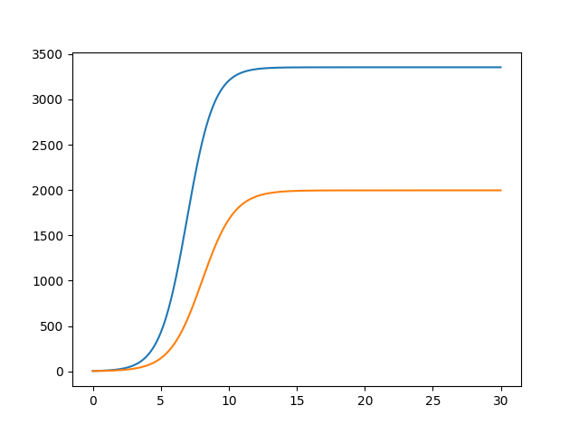
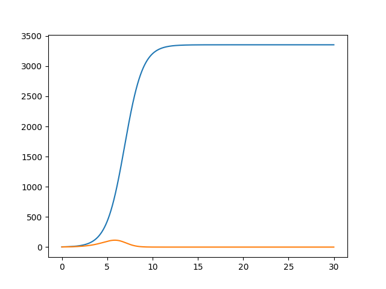

---
## Front matter
lang: ru-RU
title: "Лабораторная работа №8: Модель конкуренции двух фирм"
subtitle: "*дисциплина: Математическое моделирование*"
author: "Ширяев Кирилл Владимирович"
date: 2021, 11 March

## Formatting
mainfont: PT Serif
romanfont: PT Serif
sansfont: PT Sans
monofont: PT Mono
toc: false
slide_level: 2
theme: metropolis
header-includes:
 - \metroset{progressbar=frametitle,sectionpage=progressbar,numbering=fraction}
 - '\makeatletter'
 - '\beamer@ignorenonframefalse'
 - '\makeatother'
aspectratio: 43
section-titles: true

---

# Цель работы

Ознакомиться с моделью "Конкуренция двух фирм" и построить графики по этой модели.

# Задание

Вариант 39

Построить график конкуренции двух фирм, для двух случаев:  
1)
  $$\frac{{d}M_1}{{d}\theta} = M_1 - \frac{b}{c_1}M_1M_2 - \frac{a_1}{c_1}M_1^2$$  
  $$\frac{{d}M_2}{{d}\theta} = \frac{c_2}{c_1}M_2-\frac{b}{c_1}M_1M_2 - \frac{a_2}{c_1}M_2^2$$  
  
где $a_1 = \frac{p_{cr}}{\tau_1^2\tilde p_1^2 Nq}$ , $a_2 = \frac{p_{cr}}{\tau_2^2\tilde p_2^2 Nq}$, $b = \frac{p_{cr}}{\tau_1^2\tilde p_1^2 \tau_2^2\tilde p_2^2 Nq}$ , $c_1 = \frac{p_{cr} - \tilde p_1}{\tau_1\tilde p_1}$ , $c_2 = \frac{p_{cr} - \tilde p_2}{\tau_2\tilde p_2}$  
Также введена нормировка  $t = c_1\theta$

# Задание

2)  
  $$\frac{{d}M_1}{{d}\theta} = M_1 - \frac{b}{c_1}M_1M_2 - \frac{a_1}{c_1}M_1^2$$  
  $$\frac{{d}M_2}{{d}\theta} = \frac{c_2}{c_1}M_2-(\frac{b}{c_1}+0,00093)M_1M_2 - \frac{a_2}{c_1}M_2^2$$

При следующих начальных условиях: $M_0^1 = 3.3, M_0^2 = 2.3, p_{cr} = 22, N = 33, q = 1, \tau_1 = 22, \tau_2 = 11, \tilde p_1 = 6.6, \tilde p_2 = 11.1$.

# Выполнение лабораторной работы

# Библиотеки

Подключаю все необходимые библиотеки

```
import numpy as np
import matplotlib.pyplot as plt
from scipy.integrate import odeint
```

# Случай №1
# Значения
Ввод значений из своего варианта для первого случая (39 вариант)
```
M0_1 = 3.3
M0_2 = 2.3
p_cr = 22
N = 33
q = 1
tau1 = 22
tau2 = 11
p1 = 6.6
p2 = 11.1
```
# Значения
```
a1 = p_cr/(tau1*tau1*p1*p1*N*q);
a2 = p_cr/(tau2*tau2*p2*p2*N*q);
b = p_cr/(tau1*tau1*tau2*tau2*p1*p1*p2*p2*N*q);
c1 = (p_cr-p1)/(tau1*p1);
c2 = (p_cr-p2)/(tau2*p2);


v = [M0_1,M0_2]
t = np.arange(0,30,0.01)
```
# Решение системы
```
def f1(v,t):
    dM_1 = v[0] - (b/c1)*v[0]*v[1] - (a1/c1)*v[0]*v[0]
    dM_2 = (c2/c1)*v[1] - (b/c1)*v[0]*v[1] - (a2/c1)*v[1]*v[1]
    return [dM_1,dM_2]

res = odeint(f1,v,t)
```
# Вывод графика

Вывод графика конкуренции двух фирм(рис. -@fig:001).

{#fig:001 width=70% }

# Случай №2
# Решение системы
```
def f2(v,t):
    dM_1 = v[0] - (b / c1) * v[0] * v[1] - (a1 / c1) * v[0] * v[0]
    dM_2 = (c2 / c1) * v[1] - (b/c1 + 0.00093) * v[0] * v[1] - (a2 / c1) * v[1] * v[1]
    return [dM_1, dM_2]

res2 = odeint(f2,v,t)
```
# Вывод графика

Вывод графика конкуренции двух(рис. -@fig:002).

{#fig:002 width=70% }

# Выводы

Я ознакомился с моделью "Конкуренция двух фирм" и построил графики по этой модели.